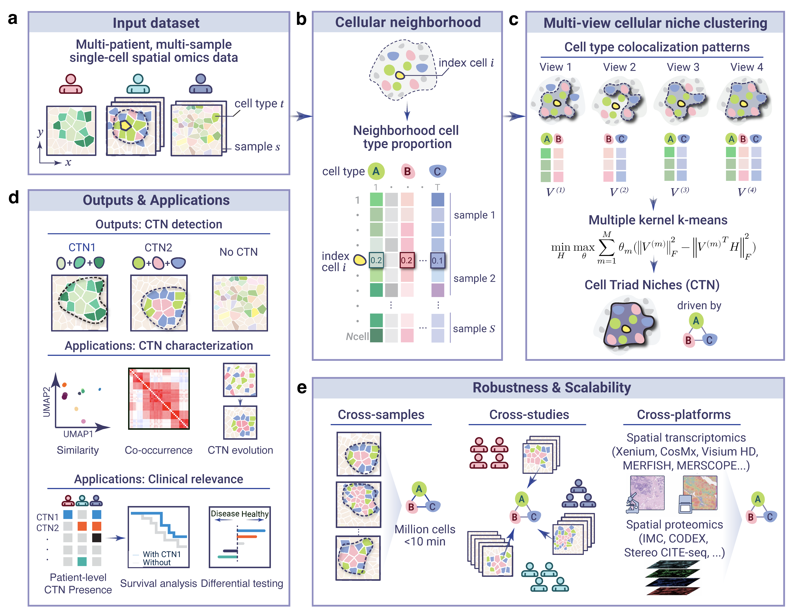

# SCOPE.CTN

<!-- badges: start -->

<!-- badges: end -->

**SCOPE** (SystematiC prOfiling of disease-relevant sPatial nichEs) is a
scalable multi-learning statistical framework that represents tissue
architecture through Cell type-Triad Niches (CTNs), which are
cohort-stable motifs of localized higher-order cell-type interactions.
SCOPE integrates multiple spatial colocalization patterns within a
multi-view learning framework to derive reusable niche vocabularies from
spatially resolved single-cell data.

{width=95%}

## Installation

Install the released version of `SCOPE.CTN` from CRAN:

``` r
install.packages("SCOPE.CTN")
```

